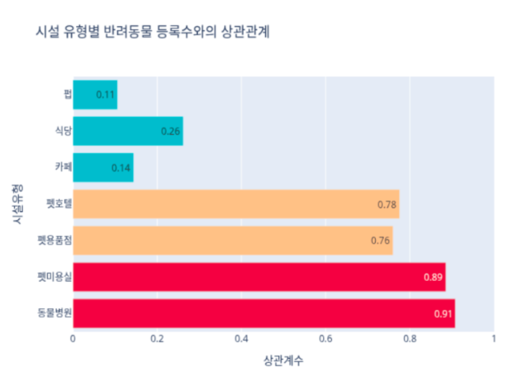
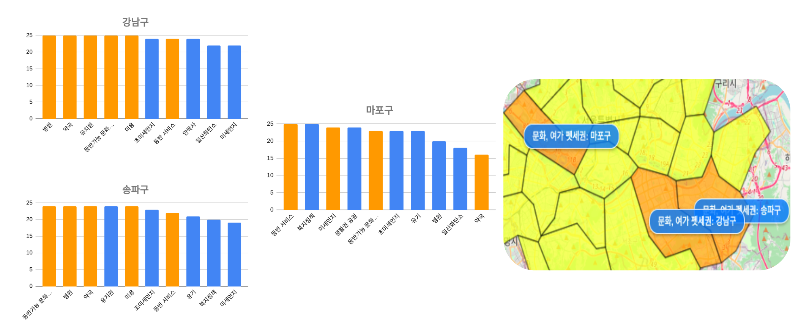

# 🐶🐱 반려동물 행복 주거지 추천 서비스 (TEAM.티니핑)
* '펫세권'으로 제시된 지표를 기반으로 반려동물과 함께 행복하게 살아갈 수 있는 주거지를 찾기 위한 데이터 분석 프로젝트입니다. 
* 서울시 자치구를 대상으로 다양한 공공 및 민간 데이터를 수집/분석하여, 이상적인 반려동물 거주 환경을 평가하고 추천합니다.
 

## 0️⃣ 팀구성 
### TEAM.티니핑

| 이름 (역할)     | 담당 업무 요약 |
|----------------|----------------|
| **이건창 (팀장)**   | 데이터 수집 및 분석, 시각화, 프로젝트 총 관리 |
| **정규호 (팀원)**   | 데이터 수집 및 분석, 시각화, DB 설계·구축 및 기술문서 관리 총괄 |
| **박재오 (팀원)**   | 데이터 수집 및 분석, 시각화, 기술문서 작성 |
| **이 수 (팀원)**    | 데이터 수집 및 분석, 시각화, 기술문서 및 DB 작성 |
| **서지민 (팀원)**   | 데이터 수집 및 분석, 시각화, 기술문서 작성 |  

  ## 1️⃣ 사용기술
| 개발환경 | 사용기술 |
|---|---|
| OS | |
| 언어 |   |
| 데이터 분석 및 시각화 |     |
| DB관리 |    |
| 협업도구 |    |
| 프로젝트 관리도구|   |

## 2️⃣ 펫세권 정의 및 지표
> #### 펫세권 정의
'펫세권'은 **반려동물을 키우기에 적합한 환경을 갖춘 주거지**를 의미함

> #### 펫세권 지표 분류
* 공공 및 민간 지표 활용

| 출처 | 펫세권 지표 |
|---|---|
|**통계청 SGIS**| 1인당 도시공원 면적, 반려동물 관련 서비스업 수, 대기 질 현황(미세먼지, 일산화탄소)|
|**다방 (부동산 어플)** | 동물병원, 미용실, 반려동물 카페, 반려동물 호텔 |
| **KB 부동산** | 카페, 음식점, 주점, 동물병원, 펫미용실, 펫몰, 펫호텔 |

## 3️⃣ 데이터 분석
* 3.1 펫세권·반려동물 등록수 경향성
* 3.2 통계청, 다방, KB 부동산 펫세권 타당성 검토 
* 3.3 반려동물 이상적 주거지 분석

### 3.1 펫세권·반려동물 등록수 경향성
* Min-Max Scaling으로 정규화 적용
* **회귀선 기울기 > 0.5** 인 경우, 강한 경향성으로 판단

 
 

|경향성|지표|
|--|--|
|**강함**|미용 업체 수, 위탁 업체 수, 병원 수, 미세먼지 농도|
|약함|1인당 도시공원 면적, CO 농도|

> ###  결론
* 총 6개 지표 중 4개에서 **기울기 > 0.5**로 상대적으로 강한 양의 경향성 확인
* 일부 지표와의 상관관계가 존재함을 나타내며, 이후 단계에서 정밀 분석진행

---
### 3.2 통계청, 다방, KB 부동산 펫세권 타당성 검토 

>  통계청 펫세권 타당성 검토
* 통계청에서 제시한 펫세권 기반으로 추천한 지역과 반려동물 등록수 비교

* 추천 받은 지역의 반려동물 등록수 3만 > 비추천 지역의 반려동물 등록수 2만
* 통계청에서 펫세권 기반으로 추천한 지역과 반려동물 등록수 간의 연관성 확인  

> 다방, KB부동산 펫세권 타당성 검토

* '펫 시설수'와 '반려동물 등록수' 연관성 약함

> ### 결론
* **통계청 데이터** '**주 데이터**'로 분석에 활용
* 다방 / KB 부동산 '보조 데이터'로 분석에 활용
---

### 3.3 반려동물 이상적 주거지 분석

> 주거지 분석 8가지 기준
* 건강
* 서비스
* 녹지
* 대기질
* 스트레스
* 오염
* 위험
* 복지

* 긍정 요인 (+) : 건강, 서비스, 녹지
* 부정 요인 (-) : 위험

> 긍정 요인만 고려한 주거지 순위  

* 각 분야 별 1위 ~ 5위 지역에, 5점 ~ 1점 순 배점

> 부정 요인만 고려한 주거지 순위  

* 각 분야 별 1위 ~ 5위 지역에, 5점 ~ 1점 순 배점

|자치구(긍정)|순위|자치구(부정)
|--|--|--|
|강남구|1위|관악구|
|서초구|2위|강서구|
|송파구|3위|도봉구|
|종로구|4위|양천구|
|마포구|5위|서초구|
---

## 4️⃣ 테마별 반려동물 주거지 추천 서비스

### 반려동물 주거지 분석 기준 테마 설정

### 서울시 자치구별 테마 분석 결과 정리 

| 테마명 | 추천 자치구 | 한줄 요약 |
|---|---|---|
| 건강 케어 | 강남구, 서초구, 송파구| "풀스택 펫 헬스 인프라 집결지"|
| 스트레스 프리 | 강북구, 은평구, 서대문구 | "숨쉬기 좋은 녹지 천국" |
| 활발한 야외 활동 | 종로구 중구, 서초구 | "숲속에서 뛰노는 일상, 녹색 산책 천국" |
| 문화 · 여가 동행 | 강남구, 마포구, 송파구 | "펫과 함께하는 쇼핑과 산책, 문화가 흐르는 거리" |
| 입양 · 봉사 관심 | 성동구, 강동구, 서대문구 | "돌봄 커뮤니티 & 구조 네트워크" |

#### 1. 테마 분석 : 건강케어

* 강남구, 서초구, 송파구
* 반려동물 인프라 집결지
* 주의 요소 : 외부 공기질 및 소음 관리 필요  

#### 2. 테마 분석 : 스트레스 프리

* 강북구, 은평구, 서대문구
* 공원 면적 및 대기질 좋음
* 주의 요소 : 의료 및 서비스 부족

#### 3. 테마 분석 : 활발한 야외 활동

* 종로구, 중구, 서초구
* 공원 면적 상위권
* 주의 요소 : 의료 인프라 낮음, 소음 및 미세먼지 농도 주의

#### 4. 테마 분석 : 문화 · 여가 동행

* 강남구, 마포구, 송파구
* 반려동물 동반 시설 수 상위권
* 주의 요소 : 유기동물 발생률 및 소음 민원 상대적 높음

#### 5. 테마 분석 : 입양 · 봉사 관심

* 성동구, 강동구, 서대문구
* 복지정책 · 보호소 상위권
* 주의 요소 : 의료·미용 등 서비스 인프라 부족

---

## 5️⃣ 견종별 주거지 추천 서비스
* 견종별 성격 분석 후 행복한 주거지 추천 서비스  

### 집단 1

__집단 1 특징__
* 소음과 낯선 환경에 매우 민감
* 말티즈, 치와와, 포메라니안

#### 집단 1 추천 지역 
1) 펫·건강 케어

* 강남구, 송파구, 서초구

2) 펫 스트레스-프리

* 강북구, 은평구, 서대문구

### 집단 2

__집단 2 특징__
* 활동적이고 운동량 많음
* 진돗개, 골든 리트리버, 말라뮤트

#### 집단 2 추천 지역
1) 산책·놀이 중심

* 종로구, 중구, 서초구

### 집단 3

__집단 3 특징__
* 사회적이고, 활동량 적당히 필요
* 푸들, 시츄, 비숑 프리제

#### 집단 3 추천 지역
1) 펫·건강 케어

* 송파구, 강남구, 서초구

2) 문화·여가 동행

* 마포구, 강남구, 송파구

### 집단 4

__집단 4 특징__
* 활동량 매우 많고, 사교적, 경계심 있음
* 비글

#### 집단 4 추천 지역
1) 산책·놀이 중심

* 종로구, 중구, 서초구

2) 펫 스트레스-프리

* 강북구, 은평구, 서대문구

> 견종별 성격 출처 : (The American Kennel Club) https://www.akc.org/dog-breeds/?letter=M, (The Royal Kennel Club) https://www.thekennelclub.org.uk/search/breeds-a-to-z/   
견조별 사진 : 구글 이미지

=======